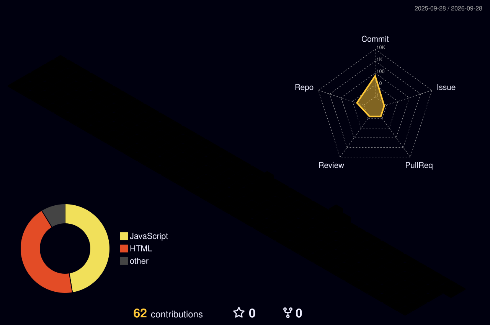

## ⚡ About
B.Tech CSE '26. I design, ship and **operate** AI automations in production — I direct Claude Code from requirements to architecture, tests and live monitoring. I run **NavaPrastha**, a websites + WhatsApp-automation studio for small businesses.

## 🚀 What's running / built
| | Project | What it does |
|---|---|---|
| 🟢 live | **WhatsApp lead-gen bot** (n8n + WAHA + LLM) | Classifies inbound leads, auto-replies in real time, syncs qualified leads to Google Sheets — serves a paying client |
| 🟢 live | **[unknownbhaarath](https://github.com/bodavulasiddardha-png/unknownbhaarath)** | Autonomous, self-healing content agent on GitHub Actions: research → fact-check → design → publish, 3 posts/day |
| 🟡 prototype | **Voice agent** (Bolna + Deepgram + Groq + Twilio + self-hosted Telugu TTS) | Inbound calls in Telugu/English; works end to end, TTS latency is the open problem |
| 🟢 built | **[n8n AI workflows](https://github.com/bodavulasiddardha-png/N8N-Automation-Workflows)** | Gmail triage agent (Claude) and an AI job-match bot → Telegram |

## 🧰 Toolbox

      

## 🐍 Contribution snake

<picture>
  <source media="(prefers-color-scheme: dark)" srcset="https://raw.githubusercontent.com/bodavulasiddardha-png/bodavulasiddardha-png/output/github-snake-dark.svg"/>
  
</picture>

## 🧊 Contributions in 3D

## 🧠 A decision I'm proud of
For the voice agent I measured each stage (STT / LLM / TTS) instead of guessing. TTS was the bottleneck (~18–20 s to synthesise ~10 s of audio), so I kept it a **prototype** rather than put real callers through it — and documented the gap.

**Open to AI Automation / Agentic AI internships** · remote, Hyderabad, Bengaluru or Chennai · 📫 bodavulasiddardha@gmail.com

