  
  
  
  


<picture>
  <source media="(prefers-color-scheme: dark)" srcset="assets/readme-kit/header-projects-dark.svg">
  <source media="(prefers-color-scheme: light)" srcset="assets/readme-kit/header-projects-light.svg">
  
</picture>

  <a href="https://navaprastha.pages.dev"></a>
  <a href="https://github.com/bodavulasiddardha-png/unknownbhaarath"></a>
  <a href="https://github.com/bodavulasiddardha-png/telugu-voice-agent"></a>
  <a href="https://github.com/bodavulasiddardha-png/N8N-Automation-Workflows"></a>

<picture>
  <source media="(prefers-color-scheme: dark)" srcset="assets/readme-kit/header-stack-dark.svg">
  <source media="(prefers-color-scheme: light)" srcset="assets/readme-kit/header-stack-light.svg">
  
</picture>



<picture>
  <source media="(prefers-color-scheme: dark)" srcset="assets/readme-kit/header-journey-dark.svg">
  <source media="(prefers-color-scheme: light)" srcset="assets/readme-kit/header-journey-light.svg">
  
</picture>



<picture>
  <source media="(prefers-color-scheme: dark)" srcset="assets/readme-kit/header-certs-dark.svg">
  <source media="(prefers-color-scheme: light)" srcset="assets/readme-kit/header-certs-light.svg">
  
</picture>

  
  
  
  

<picture>
  <source media="(prefers-color-scheme: dark)" srcset="assets/readme-kit/header-activity-dark.svg">
  <source media="(prefers-color-scheme: light)" srcset="assets/readme-kit/header-activity-light.svg">
  
</picture>

  <picture>
    <source media="(prefers-color-scheme: dark)" srcset="https://raw.githubusercontent.com/bodavulasiddardha-png/bodavulasiddardha-png/output/github-snake-dark.svg"/>
    
  </picture>

<b>Latest videos on <a href="https://www.youtube.com/@worth_knowing2">Worth Knowing</a></b>

<!-- VIDEOS:START -->
<table><tr>
<td width="33%" align="center"> Chat GPT Writes an Essay for a Yes/No Question. These 2 New AIs Don...</td>
<td width="33%" align="center"> BRICS 2026, India’s Space Station &amp; AI’s Biggest Breakthroughs...</td>
<td width="33%" align="center"> BRICS 2026, India’s Space Station &amp; AI’s Biggest Breakthroughs...</td>
</tr></table>
<!-- VIDEOS:END -->

<picture>
  <source media="(prefers-color-scheme: dark)" srcset="assets/readme-kit/header-connect-dark.svg">
  <source media="(prefers-color-scheme: light)" srcset="assets/readme-kit/header-connect-light.svg">
  
</picture>

Open to <b>AI Automation / Agentic AI internships</b> - remote, Hyderabad, Bengaluru or Chennai bodavulasiddardha@gmail.com

